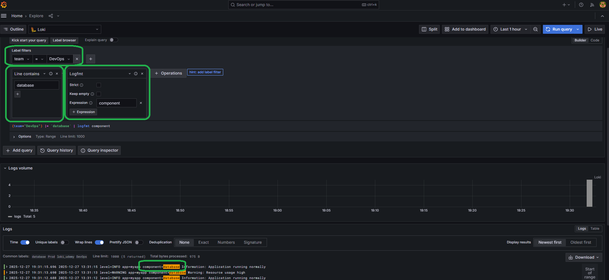

## 9-6. Creating and Attaching Static Labels
```bash
infra/promtail/promtail-config.yml
```
```bash
scrape_configs:
  - job_name: system
    static_configs:
      - targets:
          - localhost
        labels:
          job: varlogs
          __path__: /var/log/*log

  - job_name: loki_udemy
    static_configs:
      - targets:
          - localhost
        labels:
          job: loki_udemy
          __path__: /var/log/loki_udemy.log
          team: DevOps # Add this lines
          env: Prodbash # Add this lines
```
### than u can filter
